# AWS App Runner Workshop

## 概要
[AppRunnerWorkshop](https://catalog.us-east-1.prod.workshops.aws/workshops/e801f943-aad8-4d9e-aa8a-3bcc2913340f/en-US)をCDKで実装している。

## アーキテクチャ


## ディレクトリ構成

```bash
.
├── README.md
├── ap  #サンプルアプリをそのまま格納
│   ├── CODE_OF_CONDUCT.md
│   ├── CONTRIBUTING.md
│   ├── Dockerfile
│   ├── LICENSE
│   ├── README.md
│   ├── app.js
│   ├── base-infra.yaml
│   ├── bin
│   ├── config.js
│   ├── create-a-tracer.js
│   ├── package-lock.json
│   ├── package.json
│   ├── public
│   ├── rds.js
│   ├── routes
│   ├── views
│   └── workshop-infra.yaml
├── architecture.drawio.svg
└── cdk
    ├── README.md
    ├── bin
    ├── cdk.json
    ├── cdk.out
    ├── jest.config.js
    ├── lib
    ├── package-lock.json
    ├── package.json
    ├── test
    └── tsconfig.json

```

※サンプルアプリは以下のもの

https://github.com/aws-samples/apprunner-hotel-app

## デプロイ手順
* `cdk`配下で `cdk deploy` を行うのみ。